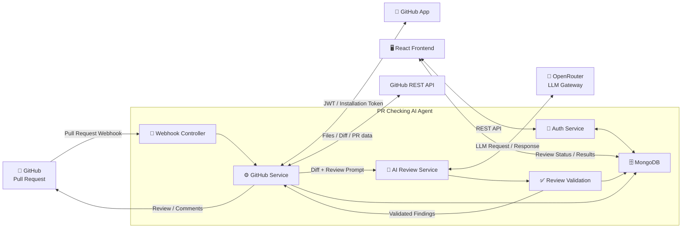

# PR Checking AI Agent

[](https://nodejs.org/)
[](https://expressjs.com/)
[](https://react.dev/)
[](https://www.typescriptlang.org/)
[](https://vite.dev/)
[](https://github.com/)
[](https://openrouter.ai/)
[](https://www.mongodb.com/)

> **AI-powered GitHub Pull Request code review agent.**

PR Checking AI Agent automatically analyzes GitHub Pull Requests using Large Language Models (LLMs) to identify potential issues and generate structured, actionable code review findings.

The system integrates **GitHub App**, **GitHub Webhooks**, **GitHub REST API**, and **OpenRouter** to automate the code review workflow around Pull Requests.

---

## ✨ Features

* 🤖 AI-powered Pull Request code review
* 🐙 GitHub App integration
* 🔔 GitHub Pull Request Webhooks
* 🔑 GitHub Installation Token authentication
* 🔐 GitHub OAuth authentication
* 📄 Fetch Pull Request files and diffs
* 🔍 Focus on added and modified code
* 🧠 Structured AI review findings
* 📍 Map findings to changed lines
* 💬 Post review comments back to GitHub
* 🛡️ API rate limiting
* 🍪 Session-based authentication
* 🔄 Access & refresh token support
* 📊 Review status and results
* 🗄️ MongoDB persistence

---

## 🏗️ Architecture



---

## 🔄 How It Works

### 1. Create or update a Pull Request

A developer opens, reopens, or updates a Pull Request on GitHub.

Supported events can include:

```text
pull_request.opened
pull_request.synchronize
pull_request.reopened
```

---

### 2. GitHub sends a Webhook

GitHub sends the Pull Request event to the backend.

The webhook contains information such as:

* Repository owner
* Repository name
* Pull Request number
* Installation ID
* Head commit SHA
* Pull Request action

```text
GitHub
   │
   │ Pull Request Event
   ▼
Webhook Controller
```

---

### 3. Authenticate as GitHub App

The backend uses the GitHub App private key to generate a JWT.

```text
GitHub App Private Key
          │
          ▼
         JWT
          │
          ▼
Installation ID
          │
          ▼
Installation Access Token
```

The Installation Token provides the permissions required to access the repository and Pull Request.

---

### 4. Fetch Pull Request changes

The GitHub service retrieves the Pull Request files and diff.

The review primarily focuses on:

* Added lines
* Modified lines
* File paths
* Relevant diff context
* Pull Request metadata

---

### 5. Send the diff to the AI

The diff is sent to the AI Review Service.

The application uses **OpenRouter** as the LLM gateway.

The reviewer is instructed to analyze areas such as:

* Correctness
* Security
* Reliability
* Maintainability
* Performance
* Testing
* API contracts
* Schema compatibility

The model should only report issues supported by the available code and context.

---

### 6. Validate AI output

The AI response is converted into a structured review format.

Example:

```json
{
  "summary": "The PR contains several issues that should be addressed.",
  "findings": [
    {
      "file": "src/server.js",
      "line": 42,
      "side": "RIGHT",
      "severity": "medium",
      "confidence": 0.95,
      "title": "Hardcoded server port",
      "explanation": "The server uses a hardcoded port instead of the configured environment variable.",
      "suggested_fix": "Use process.env.PORT with a fallback value.",
      "needs_full_file": false
    }
  ]
}
```

---

### 7. Map findings to the diff

AI-generated findings are mapped against the actual Pull Request diff.

Only findings that can be reliably associated with changed code should be used as inline comments.

This helps prevent:

* Invalid GitHub review comments
* Incorrect line references
* Speculative findings
* Comments on unrelated code

---

### 8. Publish the review

Validated findings are sent back to GitHub.

The review can contain:

* Summary
* Inline comments
* Severity
* Confidence
* Explanation
* Suggested fixes

```text
AI Review
    │
    ▼
Validation
    │
    ▼
Finding Mapping
    │
    ▼
GitHub Pull Request
```

---

# 🧩 Tech Stack

## Backend

| Technology            | Purpose                    |
| --------------------- | -------------------------- |
| Node.js               | Runtime                    |
| Express.js            | REST API                   |
| MongoDB               | Persistent storage         |
| Mongoose              | MongoDB ODM                |
| GitHub REST API       | Repository & PR operations |
| GitHub App            | Repository authentication  |
| GitHub OAuth          | User authentication        |
| OpenRouter            | LLM gateway                |
| OpenAI-compatible SDK | AI API client              |

## Frontend

| Technology | Purpose          |
| ---------- | ---------------- |
| React      | User interface   |
| TypeScript | Type safety      |
| Vite       | Frontend tooling |

---

# 📁 Project Structure

```text
pr-checking-ai-agent/
│
├── backend/
│   ├── src/
│   │   ├── controllers/
│   │   ├── routes/
│   │   ├── services/
│   │   ├── models/
│   │   ├── middleware/
│   │   └── server.js
│   │
│   ├── keys/
│   │   └── *.private-key.pem
│   │
│   ├── .env
│   ├── package.json
│   └── ...
│
├── frontend/
│   ├── src/
│   ├── public/
│   ├── package.json
│   └── ...
│
├── TODO.md
└── README.md
```

---

# ⚙️ Requirements

Before running the project locally, install:

* Node.js 20+
* npm
* MongoDB
* Git
* GitHub account
* GitHub OAuth App
* GitHub App
* OpenRouter API key

---

# 🚀 Installation

## 1. Clone the repository

```bash
git clone https://github.com/krisaleth/pr-checking-ai-agent.git

cd pr-checking-ai-agent
```

## 2. Install backend dependencies

```bash
cd backend

npm install
```

## 3. Install frontend dependencies

```bash
cd ../frontend

npm install
```

---

# 🔐 Environment Variables

Create:

```text
backend/.env
```

Example:

```env
NODE_ENV=development

PORT=3000

MONGO_URI=mongodb://localhost:27017/pr-checking-ai-agent

SESSION_SECRET=your_session_secret

GITHUB_CLIENT_ID=your_github_oauth_client_id
GITHUB_CLIENT_SECRET=your_github_oauth_client_secret

GITHUB_APP_ID=your_github_app_id
GITHUB_APP_PRIVATE_KEY_PATH=keys/your-private-key.pem

GITHUB_WEBHOOK_SECRET=your_webhook_secret

REDIRECT_URI=http://localhost:3000/api/auth/github/callback

OPENAI_ADMIN_KEY=your_openrouter_api_key
```

> **Never commit `.env`, GitHub App private keys, OAuth secrets, or API keys to Git.**

Recommended `.gitignore`:

```gitignore
node_modules/

.env
.env.*
!.env.example

keys/*.pem

dist/
build/
logs/
```

---

# 🐙 GitHub OAuth Setup

Create a GitHub OAuth App and configure the callback URL:

```text
http://localhost:3000/api/auth/github/callback
```

Typical OAuth scopes:

```text
repo
read:user
user:email
```

For production, use an HTTPS callback URL.

---

# 🤖 GitHub App Setup

Create a GitHub App and configure the required repository permissions.

The application requires Pull Request access to:

* Read Pull Requests
* Read changed files
* Read repository information
* Create review comments

Enable the required Pull Request webhook events.

The GitHub App private key should be stored locally:

```text
backend/keys/
```

Example:

```text
backend/keys/pr-check-ai-agent.private-key.pem
```

> Never commit the private key to Git.

---

# 🌐 Local Webhook Development

GitHub cannot directly access:

```text
localhost
```

during local development.

A secure tunnel can be used to expose the local server.

For example, with Cloudflare Tunnel:

```bash
cloudflared tunnel --url http://localhost:3000
```

Configure the resulting HTTPS endpoint as the GitHub App webhook URL:

```text
https://your-tunnel.example.com/api/github/webhook
```

---

# ▶️ Running the Project

## Backend

Development:

```bash
cd backend

npm run dev
```

Production:

```bash
npm start
```

Default backend URL:

```text
http://localhost:3000
```

---

## Frontend

```bash
cd frontend

npm run dev
```

The Vite development server will display the frontend URL in the terminal.

---

# 🧪 Testing

Run backend tests:

```bash
npm test
```

Integration test:

```bash
npm run test-github-review
```

A complete GitHub review flow looks like:

```text
┌─────────────────┐
│  GitHub PR      │
└────────┬────────┘
         │
         ▼
┌─────────────────┐
│ Webhook         │
└────────┬────────┘
         │
         ▼
┌─────────────────┐
│ GitHub App Auth │
└────────┬────────┘
         │
         ▼
┌─────────────────┐
│ Fetch PR Diff   │
└────────┬────────┘
         │
         ▼
┌─────────────────┐
│ AI Review       │
└────────┬────────┘
         │
         ▼
┌─────────────────┐
│ Validate        │
│ Findings        │
└────────┬────────┘
         │
         ▼
┌─────────────────┐
│ Map Findings    │
└────────┬────────┘
         │
         ▼
┌─────────────────┐
│ GitHub Review   │
└─────────────────┘
```

---

# 🔍 AI Review Principles

The AI reviewer follows several principles.

### Actionable findings

A finding should represent a problem that can reasonably be fixed.

Avoid:

* Pure style preferences
* Personal coding preferences
* Speculative problems
* Duplicate findings
* Unrelated issues

### Evidence-based analysis

The model should only make claims supported by the provided code and context.

It should not invent:

* APIs
* Functions
* Variables
* Application behavior
* External system behavior

### Changed-code focus

The primary review target is code introduced or modified by the Pull Request.

Unchanged code should only be discussed when it is directly relevant to a problem caused by the changes.

### Security

Potential security issues may include:

* Authentication bypass
* Authorization issues
* Secret exposure
* Injection vulnerabilities
* Unsafe input handling
* Insecure configuration

### Reliability

The reviewer should look for issues that may cause:

* Runtime failures
* Incorrect state
* Race conditions
* Data loss
* Unexpected API behavior

---

# 📋 Finding Schema

Each finding follows this general structure:

```json
{
  "file": "path/to/file.js",
  "line": 10,
  "side": "RIGHT",
  "severity": "high",
  "confidence": 0.92,
  "title": "Short description",
  "explanation": "Why this is a problem.",
  "suggested_fix": "How the issue can be addressed.",
  "needs_full_file": false
}
```

### Severity

```text
critical
high
medium
low
```

### Confidence

`confidence` represents how strongly the model believes the finding is valid.

Example:

```text
0.95
```

represents high confidence.

---

# 🛡️ Security

Never commit sensitive information.

Do not commit:

```text
.env
*.pem
GitHub App private keys
OAuth client secrets
OpenRouter API keys
JWT secrets
Session secrets
Database credentials
```

For production, use environment variables or a dedicated secret-management solution.

Additional security measures should include:

* Webhook signature verification
* Secure cookies
* Strong session secrets
* Request validation
* API rate limiting
* Token expiration
* GitHub permission minimization

---

# 📈 Production Considerations

Before deploying to production, consider implementing:

* [ ] HTTPS
* [ ] Secure cookies
* [ ] Webhook signature verification
* [ ] Database indexes
* [ ] Request validation
* [ ] API rate limiting
* [ ] AI request timeout
* [ ] Retry handling
* [ ] Review queue
* [ ] Duplicate review prevention
* [ ] Logging
* [ ] Monitoring
* [ ] Error tracking
* [ ] Token/cost limits
* [ ] Diff size limits
* [ ] AI output validation
* [ ] GitHub API retry handling

---

# 🗺️ Roadmap

## GitHub Integration

* [x] GitHub OAuth
* [x] GitHub App authentication
* [x] Installation Token
* [x] Fetch Pull Request diff
* [ ] Automatic Pull Request review
* [ ] Inline review comments
* [ ] Duplicate review prevention
* [ ] Incremental review

## AI Review

* [x] OpenRouter integration
* [x] Structured review output
* [ ] Strong output validation
* [ ] Finding-to-diff mapping
* [ ] Context-aware review
* [ ] Large PR handling
* [ ] Review cost optimization

## Backend

* [x] Express API
* [x] Session authentication
* [x] Rate limiting
* [ ] Background review queue
* [ ] Better error handling
* [ ] Monitoring
* [ ] Automated tests

## Frontend

* [ ] Authentication UI
* [ ] Repository selection
* [ ] Pull Request selection
* [ ] Review status
* [ ] Review history
* [ ] Finding details
* [ ] Dashboard

## DevOps

* [ ] Production deployment
* [ ] GitHub Actions CI
* [ ] Automated tests
* [ ] Docker
* [ ] Production logging
* [ ] Monitoring

---

# 🤝 Contributing

Contributions are welcome.

Create a feature branch:

```bash
git checkout -b feature/my-feature
```

Make your changes and commit:

```bash
git add .

git commit -m "feat: add my feature"
```

Push the branch:

```bash
git push origin feature/my-feature
```

Then create a Pull Request.

---

# 📄 License

This project is currently under development.

A suitable open-source license should be added before public distribution.

---

# 👨‍💻 Project

**PR Checking AI Agent**

AI-powered GitHub Pull Request review system designed to help developers identify potential issues before merging code.

Repository:

https://github.com/krisaleth/pr-checking-ai-agent

### Topics

```text
ai
ai-code-review
code-review
github
github-app
github-api
github-actions
pull-request
pull-request-review
llm
openrouter
nodejs
express
react
typescript
mongodb
developer-tools
automation
```
